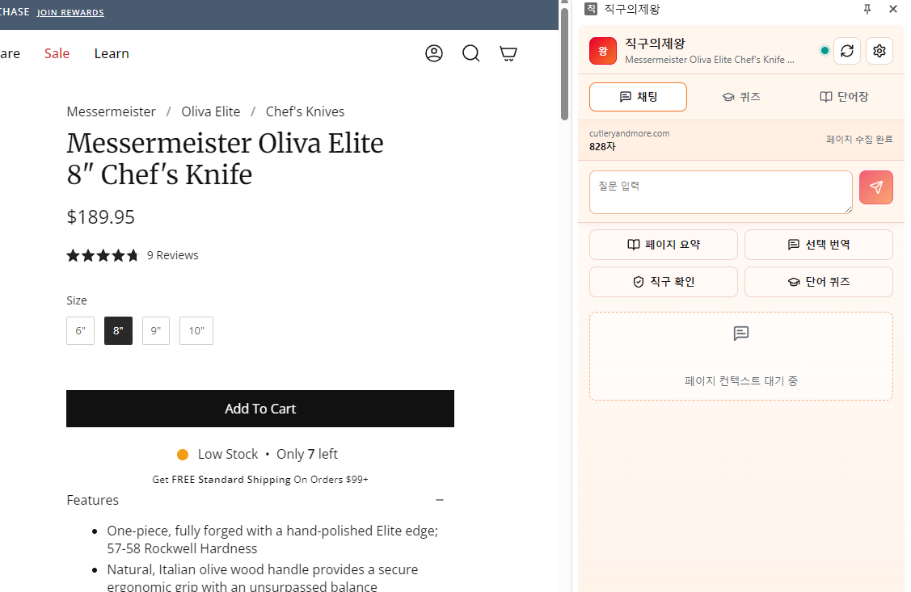
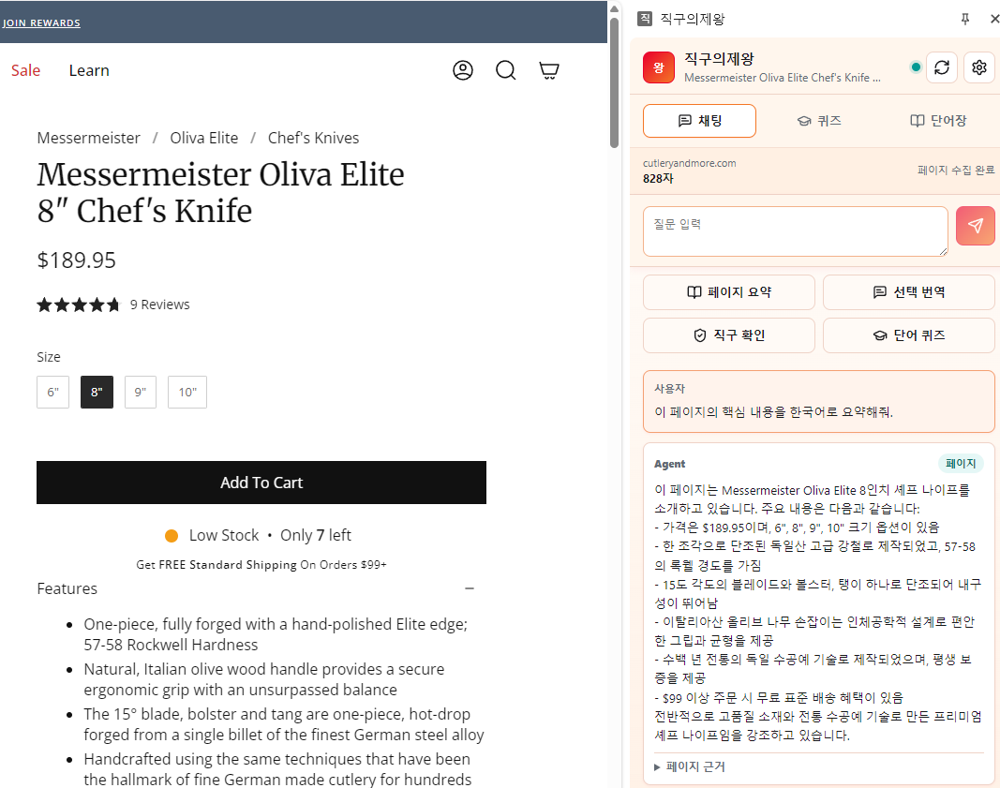

# 직구의제왕

해외 쇼핑 페이지를 보다가 모르는 상품 설명, 옵션, 배송 문구, 리뷰 표현이 나오면 현재 브라우저 페이지를 읽어 한국어로 쉽게 풀어주고, 직구 시 문제가 될 수 있는 제한 품목·안전인증·전파법·식품/의약품 관련 요건은 관세청과 식품안전나라 문서 기반 RAG로 근거를 찾아 짧게 판정해주는 Agent입니다. 동시에 페이지에 실제로 등장한 외국어 단어와 표현을 사용자의 학습 수준에 맞는 퀴즈와 단어장으로 바꿔, 해외 쇼핑을 하면서 자연스럽게 외국어까지 학습할 수 있도록 돕는 브라우저 기반 외국어 학습 및 직구 지원 도구입니다.

## 미리보기

<p align="center">
  
  
</p>

## 사용 Tool / 기술 스택

| 영역 | 사용 Tool | 역할 |
| --- | --- | --- |
| 브라우저 확장 | Chrome Extension Manifest V3 | 사용자가 보고 있는 웹페이지를 읽고 사이드패널 UI를 제공 |
| 프론트엔드 | React, TypeScript, Vite | 채팅, 페이지 요약, 선택 번역, 직구 확인, 퀴즈/단어장 화면 구현 |
| UI 아이콘 | Lucide React | 버튼과 탭에 사용하는 아이콘 제공 |
| 로컬 서버 | Node.js, Express, TypeScript | 확장 프로그램 요청을 받아 Agent 라우팅, 페이지 이해, RAG, 퀴즈 API 제공 |
| LLM 연동 | OpenAI API | 자연어 답변, 페이지 요약, 번역, 퀴즈 생성 품질 개선 |
| RAG 검색 | Python, FAISS, sentence-transformers | 관세청/식약처 문서를 벡터 검색해 직구 통관·제한 품목 근거 제공 |
| 데이터 소스 | 관세청, 식약처 공개 문서 | 해외직구 통관, 개인통관고유부호, 합산과세, 인증요건, 반입제한 정보 |
| 실행 자동화 | PowerShell, Batch | Windows에서 설치·빌드·서버 실행을 한 번에 처리 |
| 저장소 관리 | Git, GitHub CLI | GitHub 레포 생성, 커밋, push 자동화 |

## 구조

- `apps/extension`: Chrome Manifest V3 확장 프로그램
- `apps/server`: 로컬 Agent API 서버
- `/dist` : 실행 파일 

## 빠른 시작

### 크롬 익스텐션 추가 

1. 크롬 우측 상단 ... 버튼을 클릭하여 설정 클릭 
2. 설정 하단 확장프로그램 클릭
3. 우측 상단 개발자모드 클릭
4. 좌측 상단 압축해제된 확장프로그램 로드 클릭
5. /dist 폴더 선택


## OpenAI 설정

OpenAI API 키가 없으면 기본 규칙 기반 페이지 검색, RAG 검색, 퀴즈 생성으로 동작합니다. 키가 있으면 더 자연스러운 답변과 퀴즈를 생성합니다.

```bash
cp apps/server/.env.example apps/server/.env
```

`.env`에 값을 입력합니다.

```env
OPENAI_API_KEY=...
OPENAI_MODEL=gpt-4.1-mini
PORT=8787
```

## FAISS RAG 문서

관세청 해외직구 문서 목록은 `apps/server/data/rag-sources.json`에 있습니다. 아래 명령으로 원문을 다운로드하고 텍스트를 추출한 뒤 FAISS 인덱스를 생성합니다.

```bash
npm run setup:rag -w apps/server
npm run build:rag -w apps/server
```

생성 위치:

- 원문: `apps/server/data/rag/raw`
- 추출 텍스트: `apps/server/data/rag/texts`
- FAISS 인덱스: `apps/server/data/rag/index/customs.faiss`
- 청크 메타데이터: `apps/server/data/rag/index/chunks.json`

서버는 FAISS 인덱스가 있으면 우선 사용하고, 없거나 검색 실패 시 `apps/server/data/rag-docs.sample.json` 기반 키워드 검색으로 fallback합니다.

## API

- `GET /api/health`
- `POST /api/query`
- `POST /api/quiz`
- `GET /api/rag/documents`
- `POST /api/rag/documents`
